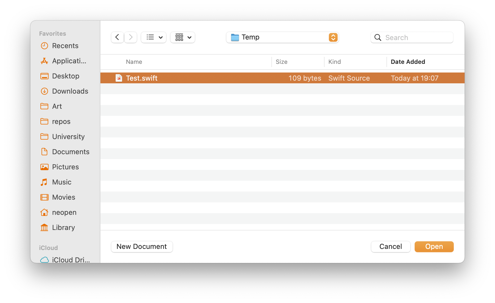
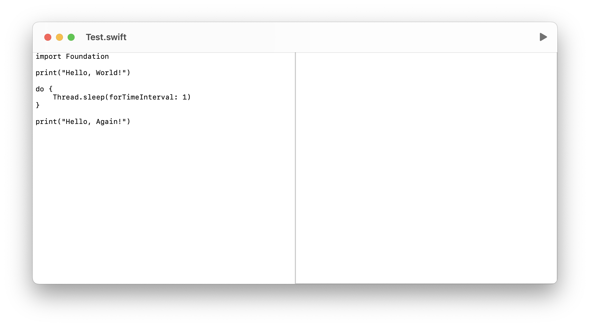
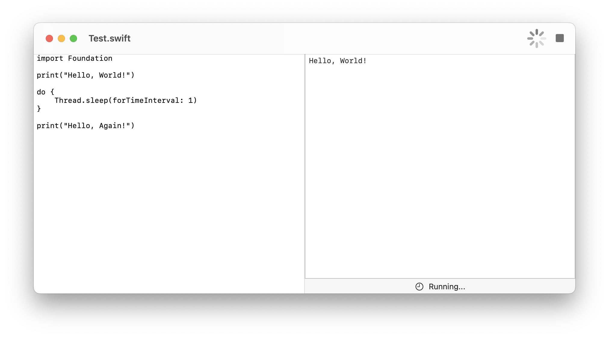
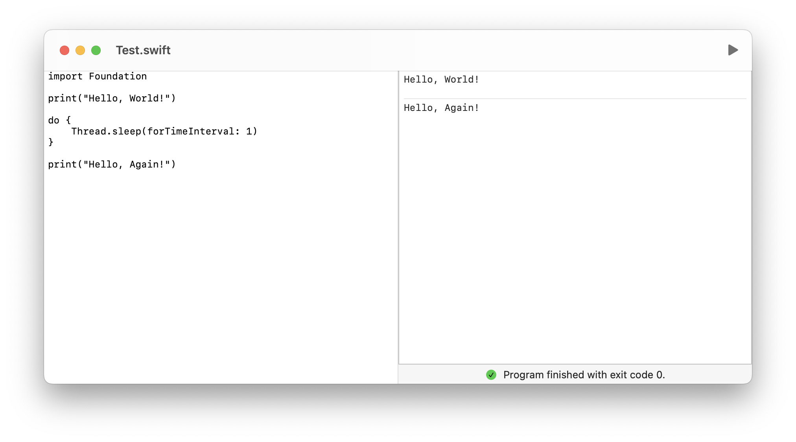
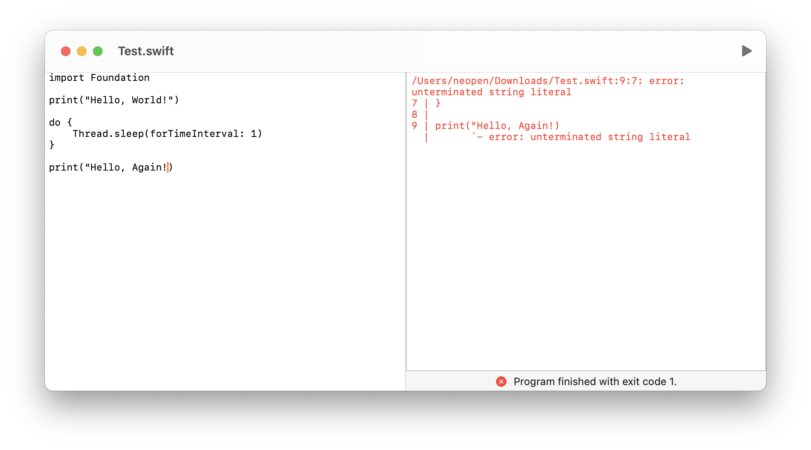

# Swift IDE

Lightweight Swift script editor.

## Features

- 100% SwiftUI
- Native document picker
- Live output of the script
- Exit code on process finish
- Click to navigate to errors

## Screenshots

## Building

The project can be imported into Xcode (tested on Xcode 16.3). It does not require any external dependencies.

- Platforms: macOS
- Minimum macOS version: 15.2
- Swift language version: 5
